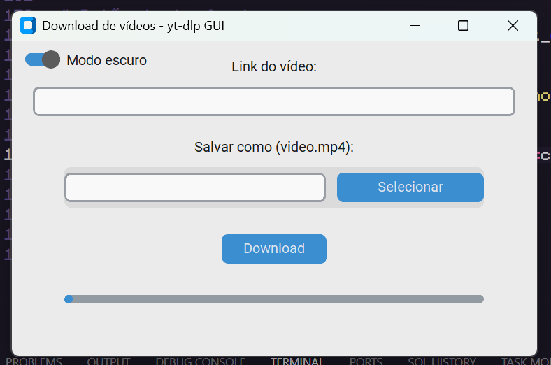
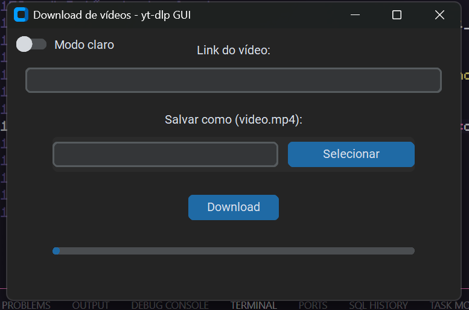

# Download de Vídeos GUI com yt-dlp


---

## Descrição

Este é um aplicativo gráfico para **download de vídeos** utilizando a ferramenta poderosa [yt-dlp](https://github.com/yt-dlp/yt-dlp). O programa possui uma interface moderna e personalizável com o framework **CustomTkinter**, que permite alternar entre modos claro e escuro.

O app facilita o download de vídeos via URL, com escolha do local e nome do arquivo, além de exibir o progresso da transferência em tempo real.

---

## Funcionalidades

- Interface amigável com CustomTkinter (modo claro e escuro)
- Entrada de URL do vídeo para download
- Seleção personalizada do caminho e nome do arquivo de saída
- Barra de progresso com atualização percentual durante o download
- Verificação automática da instalação do `yt-dlp` e tentativa de instalação/atualização
- Download em thread separada para não travar a interface
- Suporte a múltiplos formatos e merge automático para MP4

---

## Screenshots

*Adicione aqui screenshots do app em funcionamento, por exemplo:*

  


---

## Requisitos

- Python 3.8 ou superior  
- Bibliotecas Python:
  - customtkinter
  - yt-dlp  
- Sistema operacional Windows recomendado (funciona em outros, porém a instalação automática do yt-dlp é feita com winget no Windows)

---

## Instalação

1. Clone este repositório:

```bash
git clone https://github.com/Ricieri-dev/video-downloader-yt-dlp.git
cd video-downloader-yt-dlp
```

2. (Opcional, mas recomendado) Crie e ative um ambiente virtual Python:

- Windows:

```bash
python -m venv venv
venv\Scripts\activate
```

- Linux/Mac:

```bash
python3 -m venv venv
source venv/bin/activate
```

3. Instale as dependências:

```bash
pip install -r requirements.txt
```

---

## Uso

Para rodar o aplicativo, execute:

```bash
python vdo-dwnldr.py
```

---

## Executável

Após gerar, o executável estará na pasta:

```
dist\vdo-dwnldr.exe
```

---

## Licença

Este projeto está licenciado sob a Licença MIT.
Consute a licença no arquivo LICENSE para obter mais informações.

---

## Contato

Desenvolvido por Filipe Ricieri  
GitHub: [https://github.com/Ricieri-dev](https://github.com/Ricieri-dev)  
Email: ricieri.filipe@hotmail.com
